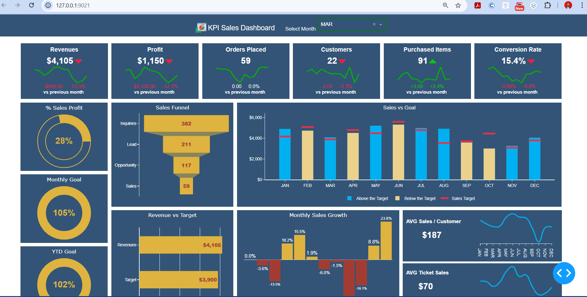

---

# 📊 KPI Sales Dashboard



## 📖 Overview

The **KPI Sales Dashboard** is a robust tool designed to visualize and track key performance indicators (KPIs) for sales performance over time. This dashboard provides business owners, sales teams, and analysts with valuable insights into revenues, profits, orders, and customer trends to make informed decisions and optimize sales strategies.


---

## ✨ Key Features

### 💰 **Revenue & Profit Analysis**
- Real-time display of monthly **Revenue** and **Profit** trends.
- Percentage changes and dollar differences are shown compared to the previous month.

### 📈 **Sales Metrics**
- **Orders Placed**: Total orders processed in the selected month.
- **Customers**: Number of unique customers and their trend compared to the previous month.
- **Purchased Items**: Total items purchased with percentage growth.
- **Conversion Rate**: Conversion of inquiries into actual sales.

### 📊 **Detailed Visualizations**
1. **Sales Funnel**:
   - Visual breakdown of the sales pipeline (Inquiries → Leads → Opportunities → Sales).
   - Helps track conversion at each stage of the sales process.
2. **Bar Charts**:
   - **Sales vs. Goal**: Comparison of actual sales against targets for each month.
   - **Revenue vs. Target**: Year-to-date revenue compared to the annual target.
   - **Monthly Sales Growth**: Month-over-month growth trends for a deeper understanding of performance.
3. **Donut Charts**:
   - **% Sales Profit**: Percentage of profit from total sales.
   - **Monthly & YTD Goals**: Progress toward monthly and yearly sales targets.

### 📉 **Customer Metrics**
- **Average Sales per Customer**: Tracks the average spending by each customer.
- **Average Ticket Sales**: Tracks the average revenue generated per ticket.

---

## 🛠️ Technologies Used

| Technology        | Purpose                                        |
|--------------------|-----------------------------------------------|
| **Python Dash**    | Framework for building interactive dashboards. |
| **Plotly**         | Library for creating dynamic and engaging charts. |
| **Pandas**         | Data manipulation and analysis.               |
| **Bootstrap CSS**  | For responsive and clean UI design.           |

---

## 🚀 How to Run the Project

1. Clone the repository:
   ```bash
   git clone https://github.com/proff2022/Sales-Dashboard.git
   ```

2. Install the required dependencies:
   ```bash
   pip install -r requirements.txt
   ```

3. Run the application locally:
   ```bash
   python app.py
   ```

4. Open your browser and access:
   ```
   http://127.0.0.1:9021
   ```

---

## 📸 Analysis


1. **Revenue and Profit**:
   - Revenue for March is **$4,105**, down by **13.5%** compared to the previous month.
   - Profit stands at **$1,150**, with a **57.1%** decline from February.
2. **Sales Funnel**:
   - Out of **382 inquiries**, only **59 resulted in successful sales**.
3. **Monthly Goals**:
   - Monthly target is at **105%**, exceeding expectations.
   - Year-to-date (YTD) target progress is at **102%**.
4. **Customer Metrics**:
   - Average sales per customer: **$187**.
   - Average ticket sales: **$70**.

---

## 🌟 Impact of the Project

- **Enhanced Decision-Making**:
  Enables businesses to identify underperforming areas and prioritize actions.
- **Performance Tracking**:
  Tracks monthly and annual goals, providing clarity on overall progress.
- **Pipeline Optimization**:
  The sales funnel visualization helps focus on converting leads effectively.

---

## 🔍 Recommendations

1. **Predictive Analytics**:
   Integrate machine learning models to forecast sales and customer trends.
2. **Customer Segmentation**:
   Add functionality to segment customers by behavior, geography, or demographics.
3. **Real-Time Data Integration**:
   Connect with live data sources (e.g., CRM, ERP) for real-time updates.

---

## 📈 Future Enhancements

- **Email Notifications**:
  Send automated updates on KPIs to team members.
- **Customizable KPIs**:
  Allow users to select which KPIs to display and track.
- **Cross-Sell Insights**:
  Analyze products that are frequently purchased together.
- **Heatmap Analytics**:
  Visualize sales trends by region or customer demographics.

---

Let me know if you'd like further refinements or help with adding images or hosting!
